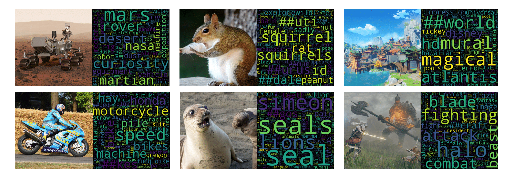

# VDR: Vocabulary Disentangled Retriever

[](https://github.com/jzhoubu/VDR/blob/master/LICENSE)
[](https://openreview.net/forum?id=ZlQRiFmq7Y)
[](https://jzhoubu.github.io/vdr.github.io/)

This is the official repository for "[Retrieval-based Disentangled Representation Learning with Natural Language Supervision](https://openreview.net/pdf?id=ZlQRiFmq7Y)".

<div align=center>
    
</div>

## What's News 🔥
- Apr. 2024: We launch an online live **[playground](https://0a157bea3880b2d119.gradio.live/)** 🎮 for VDR. Come and explore it! 
- Feb. 2024: [VDR: Retrieval-based Disentangled Representation Learning with Natural Language Supervision](https://openreview.net/pdf?id=ZlQRiFmq7Y) has been accepted as a spotlight at ICLR2024.


## 🗺 Overview

1. [Preparation](#-preparation)
    1. [Setup Environment](#setup-environment-via-poetry)
    2. [Download Data](#download-data)

2. [Quick Start](#-quick-start)
    - [Text-to-text Retrieval](#text-to-text-retrieval)
    - [Cross-modal Retrieval](#cross-modal-retrieval)
    - [Disentanglement and Reasoning](#disentanglement-and-reasoning)
    - [Visualization](#visualization)


## 💻 Preparation

### Setup Environment via poetry

```
# install poetry first
# curl -sSL https://install.python-poetry.org | python3 -
poetry install
poetry shell
```

### Setup Environment via pip

```
conda create -n vdr python=3.9
conda activate vdr
pip install -r requirements.txt
```

### Download Data

Download data using identifiers in the YAML configuration files at `conf/data_stores/*.yaml`.

```bash
# Download a single dataset file
python download.py nq_train
# Download multiple dataset files:
python download.py nq_train trivia_train
# Download all dataset files:
python download.py all
```

### Test
```bash
python -m examples.demo.quick_start
# Expected Ouput:
# tensor([[91.1257, 17.6930, 13.0358, 12.4576]], device='cuda:0')
# tensor([[0.3209, 0.0984]])
```

<!--
## 👾 Training

```bash
EXPERIMENT_NAME=test
python -m torch.distributed.launch --nnodes=1 --nproc_per_node=4 train_vdr.py \
hydra.run.dir=./experiments/$EXPERIMENT_NAME/train \
train=vdr_nq \
data_stores=train_datasets \
train_datasets=[nq_train]
```
- `hydra.run.dir`:  directory where training outputs will be saved.
- `train`: training configuration file in `conf/train/*.yaml`
- `data_stores`: data configuration file in `conf/data_stores/*.yaml` 
- `train_datasets`: identifiers of train dataset

During training, we present an `Info Card` to monitor the progress of the training. To better under the `Info Card`, please refer to [here](https://github.com/jzhoubu/VDR/tree/master/docs/info_card).
-->


## 🚀 Quick Start

### Text-to-text Retrieval
```python
>>> import torch
>>> from src.vdr import Retriever

# Initialize the retriever
>>> vdr_text2text = Retriever.from_pretrained("vsearch/vdr-nq")

# Set up the device
>>> device = torch.device('cuda' if torch.cuda.is_available() else 'cpu')
>>> vdr_text2text = vdr_text2text.to(device)

# Define a query and a list of passages
>>> query = "What are the benefits of drinking green tea?"
>>> passages = [
...     "Green tea is known for its antioxidant properties, which can help protect cells from damage caused by free radicals. It also contains catechins, which have been shown to have anti-inflammatory and anti-cancer effects. Drinking green tea regularly may help improve overall health and well-being.",
...     "The history of coffee dates back to ancient times, with its origins in Ethiopia. Coffee is one of the most popular beverages in the world and is enjoyed by millions of people every day.",
...     "Yoga is a mind-body practice that combines physical postures, breathing exercises, and meditation. It has been practiced for thousands of years and is known for its many health benefits, including stress reduction and improved flexibility.",
...     "Eating a balanced diet that includes a variety of fruits, vegetables, whole grains, and lean proteins is essential for maintaining good health. It provides the body with the nutrients it needs to function properly and can help prevent chronic diseases."
... ]

# Embed the query and passages
>>> q_emb = vdr_text2text.encoder_q.embed(query)  # Shape: [1, V]
>>> p_emb = vdr_text2text.encoder_p.embed(passages)  # Shape: [4, V]

 # Query-passage Relevance
>>> scores = q_emb @ p_emb.t()
>>> print(scores)

# Output: 
# tensor([[91.1257, 17.6930, 13.0358, 12.4576]], device='cuda:0')
```

### Cross-modal Retrieval
```python
# Note: we use `encoder_q` for text and `encoder_p` for image
>>> vdr_cross_modal = Retriever.from_pretrained("vsearch/vdr-cross-modal") 

>>> image_file = './examples/images/mars.png'
>>> texts = [
...     "Four thousand Martian days after setting its wheels in Gale Crater on Aug. 5, 2012, NASA’s Curiosity rover remains busy conducting exciting science. The rover recently drilled its 39th sample then dropped the pulverized rock into its belly for detailed analysis.",
...     "ChatGPT is a chatbot developed by OpenAI and launched on November 30, 2022. Based on a large language model, it enables users to refine and steer a conversation towards a desired length, format, style, level of detail, and language."
... ]
>>> image_emb = vdr_cross_modal.encoder_p.embed(image_file) # Shape: [1, V]
>>> text_emb = vdr_cross_modal.encoder_q.embed(texts)  # Shape: [2, V]

# Image-text Relevance
>>> scores = image_emb @ text_emb.t()
>>> print(scores)

# Output: 
# tensor([[0.3209, 0.0984]])
```


### Disentanglement and Reasoning
```python
# Disentangling query embedding
>>> disentanglement = vdr_text2text.encoder_q.dst(query, k=768, visual=True) # Generate a word cloud if `visual`=True
>>> print(disentanglement)

# Output: 
# {
#     'tea': 6.9349799156188965,
#     'green': 5.861555576324463,
#     'bitter': 4.233378887176514,
#     ...
# }

# Retrieval reasoning on query-passage match
>>> reasons = vdr_text2text.explain(q=query, p=passages[0], k=768, visual=True)
>>> print(reasons)

# Output: 
# {
#     'tea': 41.2425175410242,
#     'green': 38.784010452150596,
#     'effects': 1.1575102038585783,
#     ...
# }
```


<!--
### Example: Semi-parametric Search
```python
# Alpha search (non-parametric query -> parametric passage)
>>> q_bin = vdr.encoder_q.embed(query, bow=True)
>>> p_emb = vdr.encoder_p.embed(passages)
>>> scores = q_bin @ p_emb.t()

# Beta search (parametric query -> non-parametric passage)
>>> q_emb = vdr.encoder_q.embed(query)
>>> p_bin = vdr.encoder_p.embed(passages, bow=True)
>>> scores = q_emb @ p_bin.t()
```
-->

### Visualization

<div align=center>
    
</div>


## 🍉 Citation
If you find our code, models, or the paper useful, please cite the paper:
```
@inproceedings{
zhou2024retrievalbased,
title={Retrieval-based Disentangled Representation Learning with Natural Language Supervision},
author={Jiawei Zhou and Xiaoguang Li and Lifeng Shang and Xin Jiang and Qun Liu and Lei Chen},
booktitle={The Twelfth International Conference on Learning Representations},
year={2024},
url={https://openreview.net/forum?id=ZlQRiFmq7Y}
}
```

## License
`VDR` is licensed under the terms of the MIT license. See LICENSE for more details.
