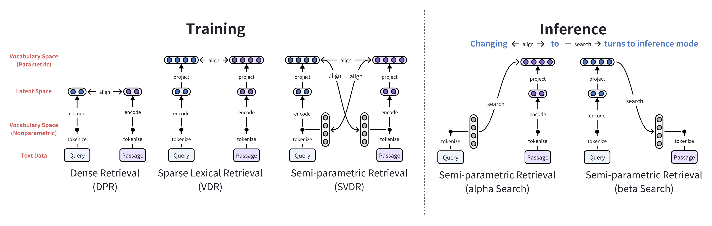

# VDR: Vocabulary Disentangled Retriever

[](https://github.com/jzhoubu/VDR/blob/master/LICENSE)
[](https://openreview.net/forum?id=ZlQRiFmq7Y)
[](https://jzhoubu.github.io/vdr.github.io/)
[](https://b6156940ffeccd05a0.gradio.live/)

Disentangling Anything over LM vocabulary for search.


This is the official repository for:
- VDR: [Retrieval-based Disentangled Representation Learning with Natural Language Supervision](https://openreview.net/pdf?id=ZlQRiFmq7Y)
- SVDR: [Semi-Parametric Retrieval via Binary Token Index](https://arxiv.org/pdf/2405.01924)

<!--
<div align=center>
    
</div>
-->

## What's News 🔥
- 2024-05-08: Launch SVDR inference pipeline for efficient, low-resource, large-scale retrieval.
- 2024-05-06: SVDR: [Semi-Parametric Retrieval via Binary Token Index](https://arxiv.org/pdf/2405.01924) has been released on arXiv. <br>
*SVDR reduces the indexing time and cost to meet various scenarios, making powerful retrieval-augmented applications accessible to everyone.*
<div align=center>
    
</div>

- 2024-04-29: We launch an online [playground](https://b6156940ffeccd05a0.gradio.live/) 🎮 for VDR image disentanglement. Come and explore it!
- 2024-01-16: VDR: [Retrieval-based Disentangled Representation Learning with Natural Language Supervision](https://openreview.net/pdf?id=ZlQRiFmq7Y) has been accepted as a spotlight at ICLR2024.


## 🗺 Overview

1. [Preparation](#-preparation)
    - Setup Environment
    - Download Data
    - Testing

2. [Quick Start](#-quick-start)
    - Text-to-text Retrieval
    - Cross-modal Retrieval
    - Disentanglement and Reasoning
    - Visualization
    - Semi-Parametric Search

3. [Training](#training) (in development 🔧, expected to be released soon)

4. [Inference](#inference)
    - Build index
    - Search
    - Scoring

## 💻 Preparation
<!--
TODA: CUDA versions test
-->


<details>
<summary>Setup Environment</summary>

### Setup Environment via poetry

```
# install poetry first
# curl -sSL https://install.python-poetry.org | python3 -
poetry install
poetry shell
```

### Setup Environment via pip

```
conda create -n vdr python=3.9
conda activate vdr
pip install -r requirements.txt
```

</details>

<details>
<summary>Download Data</summary>

Download data using identifiers in the YAML configuration files at `conf/data_stores/*.yaml`.

```bash
# Download a single dataset file
python download.py nq_train
# Download multiple dataset files:
python download.py nq_train trivia_train
# Download all dataset files:
python download.py all
```
</details>


<details>
<summary>Testing</summary>

```bash
python -m examples.demo.quick_start
# Expected Ouput:
# tensor([[91.1257, 17.6930, 13.0358, 12.4576]], device='cuda:0')
# tensor([[0.3209, 0.0984]])
```
</details>

<!--
## 👾 Training

```bash
EXPERIMENT_NAME=test
python -m torch.distributed.launch --nnodes=1 --nproc_per_node=4 train_vdr.py \
hydra.run.dir=./experiments/$EXPERIMENT_NAME/train \
train=vdr_nq \
data_stores=train_datasets \
train_datasets=[nq_train]
```
- `hydra.run.dir`:  directory where training outputs will be saved.
- `train`: training configuration file in `conf/train/*.yaml`
- `data_stores`: data configuration file in `conf/data_stores/*.yaml` 
- `train_datasets`: identifiers of train dataset

During training, we present an `Info Card` to monitor the progress of the training. To better under the `Info Card`, please refer to [here](https://github.com/jzhoubu/VDR/tree/master/docs/info_card).
-->


## 🚀 Quick Start

<details>
<summary>Text-to-text Retrieval</summary>

```python
>>> import torch
>>> from src.vdr import Retriever

# Initialize the retriever
>>> vdr_text2text = Retriever.from_pretrained("vsearch/vdr-nq")

# Set up the device
>>> device = torch.device('cuda' if torch.cuda.is_available() else 'cpu')
>>> vdr_text2text = vdr_text2text.to(device)

# Define a query and a list of passages
>>> query = "What are the benefits of drinking green tea?"
>>> passages = [
...     "Green tea is known for its antioxidant properties, which can help protect cells from damage caused by free radicals. It also contains catechins, which have been shown to have anti-inflammatory and anti-cancer effects. Drinking green tea regularly may help improve overall health and well-being.",
...     "The history of coffee dates back to ancient times, with its origins in Ethiopia. Coffee is one of the most popular beverages in the world and is enjoyed by millions of people every day.",
...     "Yoga is a mind-body practice that combines physical postures, breathing exercises, and meditation. It has been practiced for thousands of years and is known for its many health benefits, including stress reduction and improved flexibility.",
...     "Eating a balanced diet that includes a variety of fruits, vegetables, whole grains, and lean proteins is essential for maintaining good health. It provides the body with the nutrients it needs to function properly and can help prevent chronic diseases."
... ]

# Embed the query and passages
>>> q_emb = vdr_text2text.encoder_q.embed(query)  # Shape: [1, V]
>>> p_emb = vdr_text2text.encoder_p.embed(passages)  # Shape: [4, V]

 # Query-passage Relevance
>>> scores = q_emb @ p_emb.t()
>>> print(scores)

# Output: 
# tensor([[91.1257, 17.6930, 13.0358, 12.4576]], device='cuda:0')
```
</details>


<details>
<summary>Cross-modal Retrieval</summary>

```python
# Note: we use `encoder_q` for text and `encoder_p` for image
>>> vdr_cross_modal = Retriever.from_pretrained("vsearch/vdr-cross-modal") 

>>> image_file = './examples/images/mars.png'
>>> texts = [
...     "Four thousand Martian days after setting its wheels in Gale Crater on Aug. 5, 2012, NASA’s Curiosity rover remains busy conducting exciting science. The rover recently drilled its 39th sample then dropped the pulverized rock into its belly for detailed analysis.",
...     "ChatGPT is a chatbot developed by OpenAI and launched on November 30, 2022. Based on a large language model, it enables users to refine and steer a conversation towards a desired length, format, style, level of detail, and language."
... ]
>>> image_emb = vdr_cross_modal.encoder_p.embed(image_file) # Shape: [1, V]
>>> text_emb = vdr_cross_modal.encoder_q.embed(texts)  # Shape: [2, V]

# Image-text Relevance
>>> scores = image_emb @ text_emb.t()
>>> print(scores)

# Output: 
# tensor([[0.3209, 0.0984]])
```
</details>


<details>
<summary>Disentanglement and Reasoning</summary>

### Data Disentanglement
```python
# Disentangling query embedding
>>> disentanglement = vdr_text2text.encoder_q.dst(query, k=768, visual=True) # Generate a word cloud if `visual`=True
>>> print(disentanglement)

# Output: 
# {
#     'tea': 6.9349799156188965,
#     'green': 5.861555576324463,
#     'bitter': 4.233378887176514,
#     ...
# }
```

### Retrieval Reasoning
```python
# Retrieval reasoning on query-passage match
>>> reasons = vdr_text2text.explain(q=query, p=passages[0], k=768, visual=True)
>>> print(reasons)

# Output: 
# {
#     'tea': 41.2425175410242,
#     'green': 38.784010452150596,
#     'effects': 1.1575102038585783,
#     ...
# }
```
</details>

<details>
<summary>Semi-Parametric Search</summary>

### Alpha search
```python
# non-parametric query -> parametric passage
>>> q_bin = vdr.encoder_q.embed(query, bow=True)
>>> p_emb = vdr.encoder_p.embed(passages)
>>> scores = q_bin @ p_emb.t()
```

### Beta search
```python
# parametric query -> non-parametric passage (binary token index)
>>> q_emb = vdr.encoder_q.embed(query)
>>> p_bin = vdr.encoder_p.embed(passages, bow=True)
>>> scores = q_emb @ p_bin.t()
```
</details>

<details>
<summary>Visualization</summary>

<div align=center>
    
</div>

</details>


<!--
## Pipelines

### Training

```bash
EXPERIMENT_NAME=test
python -m torch.distributed.launch --nnodes=1 --nproc_per_node=4 train_vdr.py \
hydra.run.dir=./experiments/${EXPERIMENT_NAME}/train \
train=vdr_nq \
data_stores=train_datasets \
train_datasets=[nq_train]
```
- `hydra.run.dir`: Specifies the directory where training outputs will be saved
- `train`: Identifier for the training config, which corresponds to a specific file located in conf/train/*.yaml.
- `data_stores`: Identifier for the datastore, found in conf/data_stores/*.yaml.
- train_datasets: List of identifiers for the training datasets to be used.

During training, we display `Info Card` to monitor progress for stable and transparent training. For a better understanding of the `Info Card`, please refer to the documentation available [here](https://github.com/jzhoubu/VDR/tree/master/docs/info_card).
-->

## Training
In development 🔧, expected to be released soon.


## Inference
<details>
<summary>Build Index</summary>

### Build a Binary Token Index
To construct a binary token index for text corpus:
```bash
python -m inference.build_index.build_binary_index \
        --text_file="path/to/your/corpus_file.jsonl" \
        --save_file="path/to/your/output_index.npz" \
        --batch_size=256 \
        --num_shift=999 \
        --max_len=256
```
Parameters:
- `--text_file`: Specifies the path to the corpus file to be indexed (.jsonl format).
- `--save_file`: Specifies the path where the index file will be saved (.npz format).
- `--batch_size`: batch size for processing.
- `--num_shift`: Allows for shifting the vocabulary token IDs by a specified amount.
- `--max_len`: Specifies the maximum length for tokenization of the documents. 

</details>


<details>
<summary>Search</summary>

### Beta Search on Binary Token Index
```bash
python -m inference.search.beta_search \
        --checkpoint=vsearch/vdr-nq \
        --query_file="path/to/your/query_file.jsonl" \
        --text_file="path/to/your/corpus_file.jsonl" \
        --index_file="path/to/your/output_index.npz" \
        --save_file="path/to/your/output_result.json"  \
        --device=cuda
```
</details>


<details>
<summary>Scoring</summary>

### Scoring on Wiki21m benchmark
```bash
python -m inference.search.beta_search \
        --checkpoint=vsearch/vdr-nq \
        --query_file="path/to/your/query_file.jsonl" \
        --text_file="path/to/your/corpus_file.jsonl" \
        --index_file="path/to/your/output_index.npz" \
        --save_file="path/to/your/output_result.json"  \
        --device=cuda
```
</details>


## 🍉 Citation
If you find this repository useful, please consider giving ⭐ and citing our paper:
```
@inproceedings{zhou2023retrieval,
  title={Retrieval-based Disentangled Representation Learning with Natural Language Supervision},
  author={Zhou, Jiawei and Li, Xiaoguang and Shang, Lifeng and Jiang, Xin and Liu, Qun and Chen, Lei},
  booktitle={The Twelfth International Conference on Learning Representations},
  year={2023}
}
```
```
@article{zhou2024semi,
  title={Semi-Parametric Retrieval via Binary Token Index},
  author={Zhou, Jiawei and Dong, Li and Wei, Furu and Chen, Lei},
  journal={arXiv preprint arXiv:2405.01924},
  year={2024}
}
```
## License
`VDR` is licensed under the terms of the MIT license. See LICENSE for more details.
