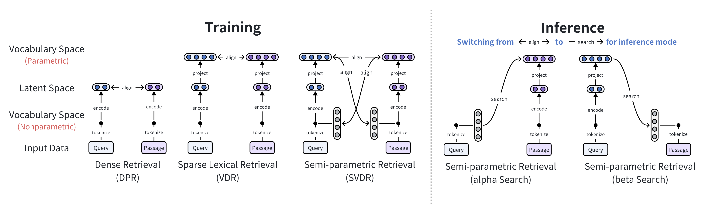
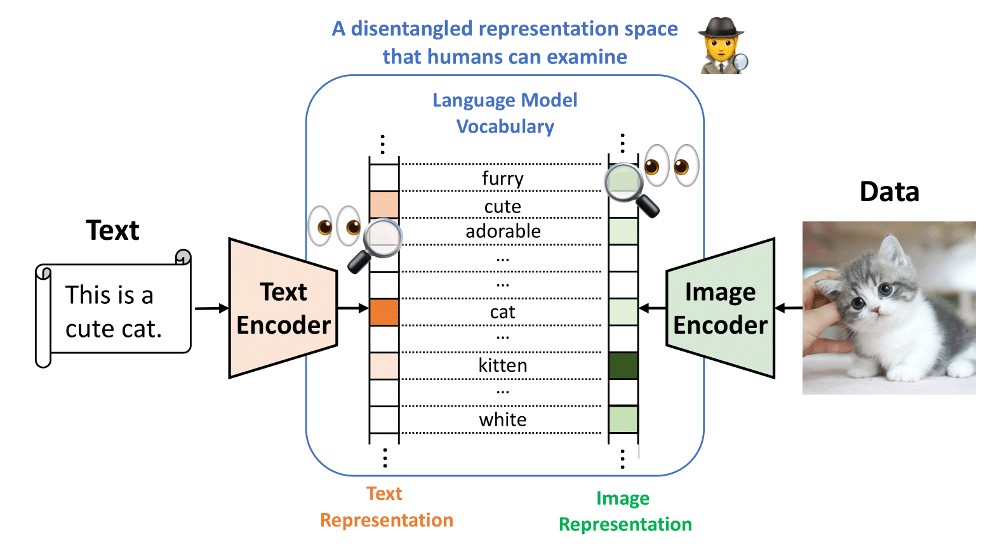
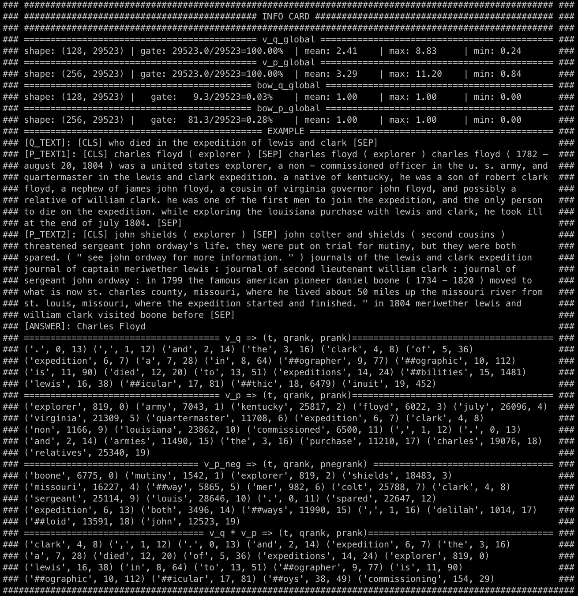

# Vsearch

[](https://github.com/jzhoubu/VDR/blob/master/LICENSE)


**Vsearch**: Disentangling Data on LM <u>**V**</u>ocabulary Space for <u>**Search**</u>. 

An extensible, transparent, trainable toolbox for retrieval-augmented frameworks, designed to be user-friendly, efficient, and accessible, empowering individuals to customize and deploy their own retrieval-based applications.


This repository includes:
- VDR: [Retrieval-based Disentangled Representation Learning with Natural Language Supervision](https://openreview.net/pdf?id=ZlQRiFmq7Y) 
  <details>
    <summary>Click to see details of VDR.</summary>
    VDR disentangles multi-modal data on MLM vocabulary space for interpretable and effective multimodal retrieval model.
    <div>
    <a href="https://openreview.net/forum?id=ZlQRiFmq7Y"></a>
    <a href="https://jzhoubu.github.io/vdr.github.io/"></a>
    </div>
  </details>

- SVDR: [Semi-Parametric Retrieval via Binary Token Index](https://arxiv.org/pdf/2405.01924)
  <details>
    <summary>Click to see details of SVDR. </summary>
    <div style="font-style: italic;">
    SVDR reduces the indexing time and cost to meet various scenarios, making powerful retrieval-augmented applications accessible to everyone.
    </div>
    <div align="center">
        
    </div>
  </details>

<!--
<div align=center>
    
</div>
-->

## What's News 🔥
- 2024-06-21: We release examples and results of dense and sparse retrieval for large-scale inference on local data. Check details in `examples/inference_dense` and `examples/inference_sparse`.
- 2024-05-17: We launched the training code and pipeline.
- 2024-05-08: We launched a semi-parametric inference pipeline (for low-resource, efficient, large-scale retrieval).
- 2024-05-06: SVDR: [Semi-Parametric Retrieval via Binary Token Index](https://arxiv.org/pdf/2405.01924) has been published on arXiv.
- 2024-01-16: VDR: [Retrieval-based Disentangled Representation Learning with Natural Language Supervision](https://openreview.net/pdf?id=ZlQRiFmq7Y) was accepted as a spotlight at ICLR2024.


## 🗺 Overview

1. [Preparation](#-preparation)
    - Setup Environment
    - Download Data

2. [Quick Start](#-quick-start)
    - Text-to-text Retrieval
    - Disentanglement and Reasoning
    - Semi-parametric Search
    - Cross-modal Retrieval

3. [Training](#-training)

4. [Inference](#-inference)
    - Build index
    - Search
    - Scoring

## 💻 Preparation

### Setup Environment via Poetry

```
# install poetry first
# curl -sSL https://install.python-poetry.org | python3 -
poetry install
poetry shell
```

<!--
### Setup Environment via pip

```
conda create -n vdr python=3.9
conda activate vdr
pip install -r requirements.txt
```
-->


### Download Data

Download data using identifiers in the YAML configuration files at `conf/data_stores/*.yaml`.

```bash
# Download a single dataset file
python download.py nq_train
# Download multiple dataset files:
python download.py nq_train trivia_train
# Download all dataset files:
python download.py all
```


<!--
<details>
<summary>Testing</summary>

```bash
python -m test.quick_start
# Expected Ouput:
# tensor([[91.1257, 17.6930, 13.0358, 12.4576]], device='cuda:0')
# tensor([[0.3209, 0.0984]])
```
</details>
-->

## 🚀 Quick Start

<details>
<summary>Text-to-text Retrieval</summary>

```python
import torch
from src.ir import Retriever

# Define a query and a list of passages
query = "Who first proposed the theory of relativity?"
passages = [
    "Albert Einstein (14 March 1879 – 18 April 1955) was a German-born theoretical physicist who is widely held to be one of the greatest and most influential scientists of all time. He is best known for developing the theory of relativity.",
    "Sir Isaac Newton FRS (25 December 1642 – 20 March 1727) was an English polymath active as a mathematician, physicist, astronomer, alchemist, theologian, and author who was described in his time as a natural philosopher.",
    "Nikola Tesla (10 July 1856 – 7 January 1943) was a Serbian-American inventor, electrical engineer, mechanical engineer, and futurist. He is known for his contributions to the design of the modern alternating current (AC) electricity supply system."
]

# Initialize the retriever
svdr = Retriever.from_pretrained("vsearch/svdr-nq")
svdr = svdr.to("cuda")

# Embed the query and passages
q_emb = svdr.encoder_q.embed(query)  # Shape: [1, V]
p_emb = svdr.encoder_p.embed(passages)  # Shape: [4, V]

 # Query-passage Relevance
scores = q_emb @ p_emb.t()
print(scores)

# Output: 
# tensor([[62.6829, 12.0408, 10.5600]], device='cuda:0')
```
</details>


<details>
<summary>Disentanglement and Reasoning</summary>

### Disentanglement and Reasoning
```python
import torch
from src.ir import Retriever

query = "Who first proposed the theory of relativity?"
passages = [
    "Albert Einstein (14 March 1879 – 18 April 1955) was a German-born theoretical physicist who is widely held to be one of the greatest and most influential scientists of all time. He is best known for developing the theory of relativity.",
    "Sir Isaac Newton FRS (25 December 1642 – 20 March 1727) was an English polymath active as a mathematician, physicist, astronomer, alchemist, theologian, and author who was described in his time as a natural philosopher.",
    "Nikola Tesla (10 July 1856 – 7 January 1943) was a Serbian-American inventor, electrical engineer, mechanical engineer, and futurist. He is known for his contributions to the design of the modern alternating current (AC) electricity supply system."
]

# Initialize the retriever
svdr = Retriever.from_pretrained("vsearch/svdr-nq")
svdr = svdr.to("cuda")

# Disentangling query embedding
dst_result = svdr.encoder_q.dst(query, topk=768, visual=False) # Generate a word cloud if `visual`=True
print(dst_result)

# Output: 
# {
#     'relativity': 6.1560163497924805, 
#     'tensor': 3.383471727371216, 
#     'gravitational': 3.117488145828247, 
#     ...
# }

# Retrieval reasoning
reasons = svdr.explain(q=query, p=passages[0], topk=768, visual=False)
print(reasons)

# Output: 
# {
#     'relativity': 39.76305470546913, 
#     'einstein': 6.619070599316387, 
#     'theory': 3.57103090893213, 
#     ...
# }
```
</details>

<details>
<summary>Semi-Parametric Search (alpha and beta search) </summary>

### Alpha search
```python
# non-parametric query -> parametric passage
q_bin = svdr.encoder_q.embed(query, bow=True)
p_emb = svdr.encoder_p.embed(passages)
scores = q_bin @ p_emb.t()
```

### Beta search
```python
# parametric query -> non-parametric passage (binary token index)
q_emb = svdr.encoder_q.embed(query)
p_bin = svdr.encoder_p.embed(passages, bow=True)
scores = q_emb @ p_bin.t()
```
</details>

<details>
<summary>Cross-modal Retrieval</summary>

```python
# Note: we use `encoder_q` for text and `encoder_p` for image
vdr_cross_modal = Retriever.from_pretrained("vsearch/vdr-cross-modal") 

image_file = './examples/images/mars.png'
texts = [
  "Four thousand Martian days after setting its wheels in Gale Crater on Aug. 5, 2012, NASA’s Curiosity rover remains busy conducting exciting science. The rover recently drilled its 39th sample then dropped the pulverized rock into its belly for detailed analysis.",
  "ChatGPT is a chatbot developed by OpenAI and launched on November 30, 2022. Based on a large language model, it enables users to refine and steer a conversation towards a desired length, format, style, level of detail, and language."
]
image_emb = vdr_cross_modal.encoder_p.embed(image_file) # Shape: [1, V]
text_emb = vdr_cross_modal.encoder_q.embed(texts)  # Shape: [2, V]

# Image-text Relevance
scores = image_emb @ text_emb.t()
print(scores)

# Output: 
# tensor([[0.3209, 0.0984]])
```
</details>

<!--
<details>
<summary>Visualization</summary>

<div align=center>
    
</div>

</details>
-->

## 👾 Training
We are testing on `python==3.9` and `torch==2.2.1`. Configuration is handled through `hydra==1.3.2`.

```bash
EXPERIMENT_NAME=test
python -m torch.distributed.launch --nnodes=1 --nproc_per_node=4 train_vdr.py \
hydra.run.dir=./experiments/${EXPERIMENT_NAME}/train \
train=vdr_nq \
data_stores=wiki21m \
train_datasets=[nq_train]
```
- `--hydra.run.dir`: Directory where training logs and outputs will be saved
- `--train`: Identifier for the training config,  in `conf/train/*.yaml`.
- `--data_stores`: Identifier for the datastore, in `conf/data_stores/*.yaml`.
- `--train_datasets`: List of identifiers for the training datasets to be used, in `data_stores`

During training, we display `InfoCard` to monitor the training progress. 

> [!TIP]
> <details><summary>What is <b><span style="color: blue;">InfoCard</span></b>?</summary>
>
> `InfoCard` is a organized log generated during the training that helps us visually track the progress.  
> 
> An `InfoCard` looks like this:
>
> 
> 
> **InfoCard Layout**
> 
> 1. Global Variables (`V(q)`, `V(p)`, etc.):
>    - Shape: Displays the dimensions of the variable matrix.
>    - Gate: Indicates the sparsity by showing the ratio of non-zero activations.
>    - Mean, Max, Min: Statistical measures of the data distribution within the variable.
> 
> 2. `EXAMPLE` Section:
>    - Contains one sample from the training batch, including query text (`Q_TEXT`), positive passages (`P_TEXT1`), negative passage (`P_TEXT2`), and the correct answer (`ANSWER`).
> 
> 3. Token Triple Sections (`V(q)`, `V(p)`, `V(p_neg)`, `V(q) * V(p)`), which provided token-level impact:
>    - Token (`t`): The specific vocabulary token.
>    - Query Rank (`qrank`): Rank of the token in the query representation.
>    - Passage Rank (`prank`): Rank of the token in the passage representation.
> </details>


## 🎮 Inference (Large-scale Retrieval)

For dense retrieval (DPR) inference, please see detailed documentation [here](examples/inference_dense/README.md).

---

For sparse retrieval (VDR) inference, please see detailed documentation [here](examples/inference_sparse/README.md).

---

For semi-parametric retrieval (SVDR) inference, see below:

### 1. Build a Binary Token Index
To construct a binary token index for text corpus:
```bash
python -m inference.build_index.binary_token_index \
        --text_file="path/to/your/corpus_file.jsonl" \
        --save_file="path/to/your/output_index.npz" \
        --batch_size=32 \
        --num_shift=999 \
        --max_len=256
```
Parameters:
- `--text_file`: Path to the corpus file to be indexed (`.jsonl` format).
- `--save_file`: Path where the index file will be saved (`.npz` format).
- `--batch_size`: Batch size for processing.
- `--num_shift`: Allows for shifting the vocabulary token IDs by a specified amount.
- `--max_len`: Maximum length for tokenization of the documents. 


### 2. Beta Search on Binary Token Index
```bash
python -m inference.search.beta_search \
        --checkpoint=vsearch/vdr-nq \
        --query_file="path/to/your/query_file.jsonl" \
        --text_file="path/to/your/corpus_file.jsonl" \
        --index_file="path/to/your/index_file.npz" \
        --save_file="path/to/your/search_result.json"  \
        --device=cuda
```
Parameters:
- `--query_file`: Path to file containing questions, with each question as a separate line (`.jsonl` format). 
- `--text_file`: Path to the corpus file (`.jsonl` format).
- `--index_file`: Path to pre-computed index file (`.npz` format).
- `--save_file`: Path where the search results will be stored (`.json` format).
- `--batch_size`: Number of queries per batch.
- `--num_rerank`: Number of passages to re-rank.

### 3. Scoring on Wiki21m benchmark
```bash
python -m inference.score.eval_wiki21m \
        --text_file="path/to/your/corpus_file.jsonl" \
        --result_file="path/to/your/search_result.json" \
        --qa_file="path/to/your/dpr_qa_file.csv"
```
Parameters:
- `--text_file`: Path to the corpus file (`.jsonl` format).
- `--result_file`: Path to search results (`.json` format).
- `--qa_file`: Path to DPR-provided qa file (`.csv` format)


## 🍉 Citation
If you find this repository useful, please consider giving ⭐ and citing our paper:
```
@inproceedings{zhou2023retrieval,
  title={Retrieval-based Disentangled Representation Learning with Natural Language Supervision},
  author={Zhou, Jiawei and Li, Xiaoguang and Shang, Lifeng and Jiang, Xin and Liu, Qun and Chen, Lei},
  booktitle={The Twelfth International Conference on Learning Representations},
  year={2023}
}
```
```
@article{zhou2024semi,
  title={Semi-Parametric Retrieval via Binary Token Index},
  author={Zhou, Jiawei and Dong, Li and Wei, Furu and Chen, Lei},
  journal={arXiv preprint arXiv:2405.01924},
  year={2024}
}
```